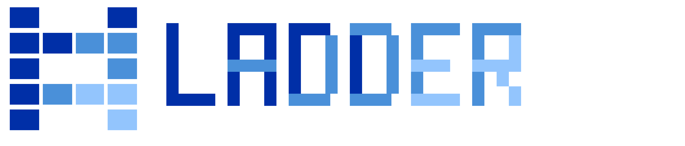
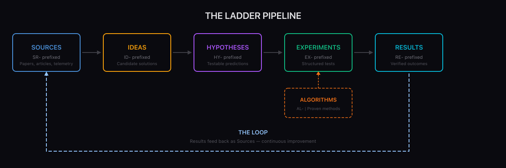
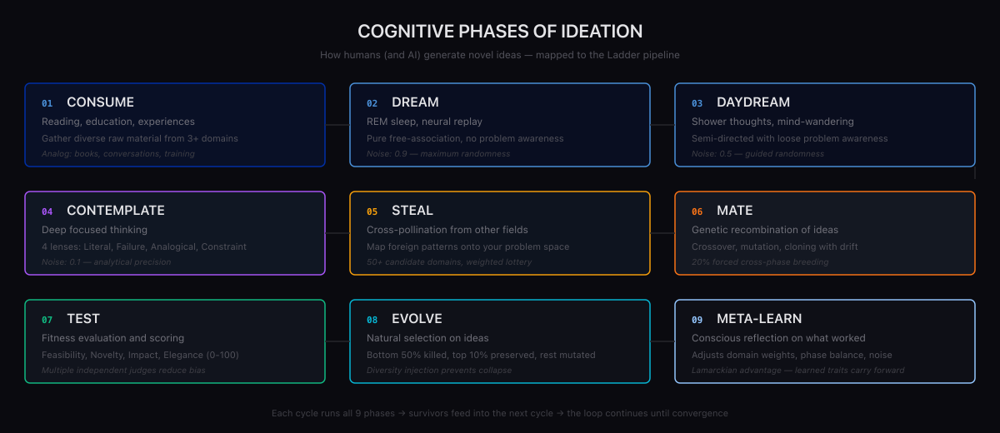
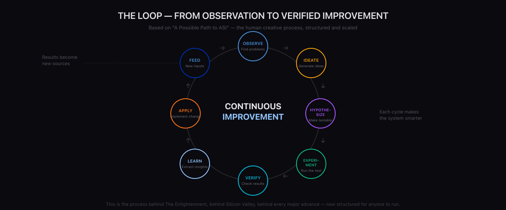

<p align="center">
  
</p>

<p align="center">
  <strong>A systematic pipeline for turning observations into verified improvements.</strong>
</p>

<p align="center">
  <a href="#the-pipeline">Pipeline</a> &middot;
  <a href="#cognitive-phases">Cognitive Phases</a> &middot;
  <a href="#the-loop">The Loop</a> &middot;
  <a href="#quick-start">Quick Start</a> &middot;
  <a href="#fork-it">Fork It</a> &middot;
  <a href="#related-work">Related Work</a>
</p>

---

Ladder is an open framework for collecting ideas, forming hypotheses, running experiments, and tracking results — the full cognitive loop that drives human progress, now structured for anyone (or any AI) to use.

## Why Ladder?

Humans make progress through a remarkably consistent process:

1. Have lots of experiences and training
2. Face challenges and problems
3. Use your knowledge to try to solve them
4. Learn from the results
5. Talk with others doing the same
6. Copy, modify, or combine their ideas with yours
7. Sleep on it — let your subconscious work
8. Bombard yourself with new inputs
9. Get sudden inspiration
10. Try again

This is the process behind The Enlightenment, behind Silicon Valley, behind every major advance. Ladder structures it so you can run it deliberately — at any scale, on any problem.

> *"We basically take the human process of learning, thinking, combining and copying ideas, sleeping on them, trying them out — and we automate the hell of it at scale."*
> — [A Possible Path to ASI](https://danielmiessler.com/blog/path-to-asi)

## The Pipeline

<p align="center">
  
</p>

Ladder organizes work into six collections, each a stage in the pipeline:

| Stage | Prefix | Description |
|-------|--------|-------------|
| **Sources** | `SR-` | Raw inputs — papers, articles, observations, system telemetry |
| **Ideas** | `ID-` | Candidate solutions or approaches generated from sources |
| **Hypotheses** | `HY-` | Testable predictions derived from ideas |
| **Experiments** | `EX-` | Structured tests of hypotheses with methodology |
| **Algorithms** | `AL-` | Proven methods for performing specific tasks |
| **Results** | `RE-` | Verified outcomes from experiments |

Each entry is a markdown file with structured frontmatter. Results feed back as sources for the next cycle — the **loop** that drives continuous improvement.

## Cognitive Phases

<p align="center">
  
</p>

Ladder's ideation stage maps to nine cognitive phases that mirror how humans actually generate novel ideas:

| Phase | Analog | What Happens |
|-------|--------|--------------|
| **CONSUME** | Reading, education | Gather diverse raw material from multiple domains |
| **DREAM** | REM sleep, dreaming | Pure free-association with no problem awareness |
| **DAYDREAM** | Shower thoughts | Semi-directed wandering with loose problem awareness |
| **CONTEMPLATE** | Deep focused thinking | Rigorous structured analysis from multiple lenses |
| **STEAL** | Cross-pollination | Map patterns from completely different domains |
| **MATE** | Genetic recombination | Combine ideas from different phases/sources |
| **TEST** | Peer review | Score each idea on feasibility, novelty, impact, elegance |
| **EVOLVE** | Natural selection | Keep the best, mutate the middle, kill the weak |
| **META-LEARN** | Reflection | Analyze what worked and adjust the strategy |

These phases aren't prescriptive — they're a vocabulary for tracking where ideas come from, so you can understand and improve your ideation process over time.

## The Loop

<p align="center">
  
</p>

The most important concept in Ladder is the **loop**: results don't just sit there — they feed back as sources for the next cycle.

A result might reveal a new problem (→ source), suggest a better approach (→ idea), or validate an algorithm (→ algorithm). This closed loop is what transforms a collection of notes into a system that actually improves things.

This is the same process described in [Pursuing the Algorithm](https://danielmiessler.com/blog/the-last-algorithm) — a generalized hill-climbing approach that applies to any domain. The loop is what makes it work: observe, hypothesize, test, learn, repeat.

## Quick Start

```bash
# Clone
git clone https://github.com/danielmiessler/Ladder.git
cd Ladder

# Install dependencies
bun install

# Add an idea
bun run ladder add idea --title "Use semantic caching for API responses"

# Add a hypothesis from that idea
bun run ladder add hypothesis --idea ID-00001 --title "Semantic cache reduces API calls by 40%"

# Add an experiment
bun run ladder add experiment --hypothesis HY-00001 --title "A/B test semantic cache vs direct calls"

# Check pipeline status
bun run ladder status

# List all ideas
bun run ladder list ideas
```

## Directory Structure

```
Ladder/
├── Sources/           # SR- Raw inputs and references
│   ├── README.md
│   └── TEMPLATE.md
├── Ideas/             # ID- Candidate solutions
│   ├── README.md
│   └── TEMPLATE.md
├── Hypotheses/        # HY- Testable predictions
│   ├── README.md
│   └── TEMPLATE.md
├── Experiments/       # EX- Structured tests
│   ├── README.md
│   └── TEMPLATE.md
├── Algorithms/        # AL- Proven methods
│   ├── README.md
│   └── TEMPLATE.md
├── Results/           # RE- Verified outcomes
│   ├── README.md
│   └── TEMPLATE.md
├── Tools/             # TypeScript CLI tooling
├── README.md
├── CLAUDE.md
├── CONTRIBUTING.md
└── LICENSE
```

## Fork It

Ladder is designed to be forked. Your fork is your instance — your problems, your ideas, your experiments.

**Personal use:** Fork it, add your own observations and problems, run your own experiments.

**Enterprise use:** Fork it, scope it to your system. Your agents find problems in your infrastructure, submit them as sources, and the pipeline turns them into verified improvements.

**AI integration:** Point your AI system at your Ladder fork. Anytime the AI encounters a problem or sees an opportunity, it submits to the pipeline. The pipeline is the optimization engine; the AI is one of many sources.

## Philosophy

Ladder is built on three beliefs:

1. **Progress is a loop, not a line.** The best ideas come from feeding results back into the system.
2. **Structure enables creativity.** Naming the cognitive phases doesn't constrain thinking — it makes it observable and improvable.
3. **Anyone can run the scientific method.** You don't need a lab. You need a problem, an idea, and a way to test it.

## Related Work

Ladder draws from a body of interconnected ideas about structured improvement, AI capability, and human creativity:

### Core Concepts

- [A Possible Path to ASI](https://danielmiessler.com/blog/path-to-asi) — The foundational thesis: ASI through scaled ideation and experimentation, emulating the human creative process
- [Pursuing the Algorithm](https://danielmiessler.com/blog/the-last-algorithm) — The concept of a generalized algorithm for continuous improvement across any domain
- [Nobody is Talking About Generalized Hill-Climbing](https://danielmiessler.com/blog/nobody-is-talking-about-generalized-hill-climbing) — Why runtime optimization through iterative hill-climbing is the key capability most people are missing
- [Introducing Substrate](https://danielmiessler.com/blog/introducing-substrate) — Open-source infrastructure for collecting problems, solutions, and evidence at scale

### AI & Knowledge Work

- [AI's Ultimate Use Case: State Transition](https://danielmiessler.com/blog/ai-state-management) — Moving from current state to desired state as the core function of intelligence
- [RAID (Real World AI Definitions)](https://danielmiessler.com/blog/raid-ai-definitions) — Precise definitions for AGI, ASI, and other AI concepts referenced throughout Ladder
- [Exactly Why and How AI Will Replace Knowledge Work](https://danielmiessler.com/blog/exactly-why-and-how-ai-will-replace-knowledge-work) — The economic forces driving AI adoption and why structured pipelines matter
- [Bitter Lesson Engineering](https://danielmiessler.com/blog/bitter-lesson-engineering) — Why you should build infrastructure that improves with scale, not clever workarounds

### Creativity & Ideation

- [Creative Output Requires Quality Inputs](https://danielmiessler.com/blog/creative-output-requires-quality-inputs) — Why the CONSUME phase matters: garbage in, garbage out
- [Increasing Creativity By Separating Input and Output Phases](https://danielmiessler.com/blog/increasing-creativity-by-clearly-separating-your-input-and-output-phases) — The science behind Ladder's phase separation
- [The Two Primary Limitations to Our Creativity](https://danielmiessler.com/blog/two-creativity-barriers) — The constraints that Ladder's cognitive phases are designed to overcome
- [AI and the World's Most Important Economic Metric](https://danielmiessler.com/blog/creativity-friction-coefficient) — How reducing the friction of creativity changes everything

### Systems & Infrastructure

- [Building a Personal AI Infrastructure (PAI)](https://danielmiessler.com/blog/personal-ai-infrastructure) — The broader system that Ladder integrates with
- [How My Projects Fit Together](https://danielmiessler.com/blog/how-my-projects-fit-together) — Where Ladder sits in the ecosystem alongside Fabric, Substrate, and PAI
- [Companies Are Just a Graph of Algorithms](https://danielmiessler.com/blog/companies-graph-of-algorithms) — Why Ladder's algorithm collection matters: every process is an algorithm that can be improved
- [Why I Created Fabric](https://danielmiessler.com/blog/fabric-origin-story) — The origin of the pattern-based approach that Ladder extends

### Human Progress

- [The Problem with Human 2.0 and the Promise of Human 3.0](https://danielmiessler.com/blog/human-3-creator-revolution) — The vision of humans as creators, augmented by tools like Ladder
- [Algorithmic Learning](https://danielmiessler.com/blog/algorithmic-learning) — Learning as a structured, improvable process — not just accumulation
- [Algorithmic vs. Faith-based Learning](https://danielmiessler.com/blog/algorithmic-vs-faith-based-learning) — Why verifiable, iterative learning beats untested assumptions
- [The Great Transition](https://danielmiessler.com/blog/the-great-transition) — The societal shift that makes tools like Ladder necessary

## Contributing

See [CONTRIBUTING.md](CONTRIBUTING.md) for how to submit sources, ideas, hypotheses, experiments, and results.

## License

MIT — see [LICENSE](LICENSE) for details.
